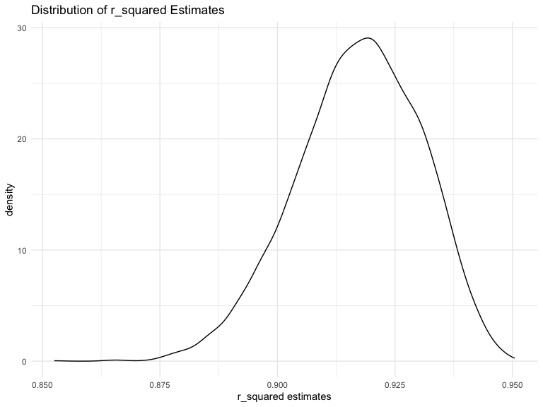

p8105_hw6_cl4469
================
Chen Liang
2023-11-29

``` r
library(tidyverse)
```

    ## ── Attaching core tidyverse packages ──────────────────────── tidyverse 2.0.0 ──
    ## ✔ dplyr     1.1.3     ✔ readr     2.1.4
    ## ✔ forcats   1.0.0     ✔ stringr   1.5.0
    ## ✔ ggplot2   3.4.3     ✔ tibble    3.2.1
    ## ✔ lubridate 1.9.2     ✔ tidyr     1.3.0
    ## ✔ purrr     1.0.2     
    ## ── Conflicts ────────────────────────────────────────── tidyverse_conflicts() ──
    ## ✖ dplyr::filter() masks stats::filter()
    ## ✖ dplyr::lag()    masks stats::lag()
    ## ℹ Use the conflicted package (<http://conflicted.r-lib.org/>) to force all conflicts to become errors

``` r
library(viridis)
```

    ## Loading required package: viridisLite

``` r
library(modelr)


knitr::opts_chunk$set(
    echo = TRUE,
    warning = FALSE,
    fig.width = 8, 
  fig.height = 6,
  out.width = "90%"
)

options(
  ggplot2.continuous.colour = "viridis",
  ggplot2.continuous.fill = "viridis"
)

scale_colour_discrete = scale_colour_viridis_d
scale_fill_discrete = scale_fill_viridis_d

theme_set(theme_minimal() + theme(legend.position = "bottom"))
```

### Problem 1

In the data cleaning code below we create a `city_state` variable,
change `victim_age` to numeric, modifiy victim_race to have categories
white and non-white, with white as the reference category, and create a
`resolution` variable indicating whether the homicide is solved. Lastly,
we filtered out the following cities: Tulsa, AL; Dallas, TX; Phoenix,
AZ; and Kansas City, MO; and we retained only the variables
`city_state`, `resolution`, `victim_age`, `victim_sex`, and
`victim_race`.

``` r
homicide_df = 
  read_csv("data/homicide-data.csv", na = c("", "NA", "Unknown")) |> 
  mutate(
    city_state = str_c(city, state, sep = ", "),
    victim_age = as.numeric(victim_age),
    resolution = case_when(
      disposition == "Closed without arrest" ~ 0,
      disposition == "Open/No arrest"        ~ 0,
      disposition == "Closed by arrest"      ~ 1)
  ) |> 
  filter(victim_race %in% c("White", "Black")) |> 
  filter(!(city_state %in% c("Tulsa, AL", "Dallas, TX", "Phoenix, AZ", "Kansas City, MO"))) |> 
  select(city_state, resolution, victim_age, victim_sex, victim_race)
```

    ## Rows: 52179 Columns: 12
    ## ── Column specification ────────────────────────────────────────────────────────
    ## Delimiter: ","
    ## chr (8): uid, victim_last, victim_first, victim_race, victim_sex, city, stat...
    ## dbl (4): reported_date, victim_age, lat, lon
    ## 
    ## ℹ Use `spec()` to retrieve the full column specification for this data.
    ## ℹ Specify the column types or set `show_col_types = FALSE` to quiet this message.

Next we fit a logistic regression model using only data from Baltimore,
MD. We model `resolved` as the outcome and `victim_age`, `victim_sex`,
and `victim_race` as predictors. We save the output as `baltimore_glm`
so that we can apply `broom::tidy` to this object and obtain the
estimate and confidence interval of the adjusted odds ratio for solving
homicides comparing non-white victims to white victims.

``` r
baltimore_glm = 
  filter(homicide_df, city_state == "Baltimore, MD") |> 
  glm(resolution ~ victim_age + victim_sex + victim_race, family = binomial(), data = _)

baltimore_glm |> 
  broom::tidy() |> 
  mutate(
    OR = exp(estimate), 
    OR_CI_upper = exp(estimate + 1.96 * std.error),
    OR_CI_lower = exp(estimate - 1.96 * std.error)) |> 
  filter(term == "victim_sexMale") |> 
  select(OR, OR_CI_lower, OR_CI_upper) |>
  knitr::kable(digits = 3)
```

|    OR | OR_CI_lower | OR_CI_upper |
|------:|------------:|------------:|
| 0.426 |       0.325 |       0.558 |

Below, by incorporating `nest()`, `map()`, and `unnest()` into the
preceding Baltimore-specific code, we fit a model for each of the
cities, and extract the adjusted odds ratio (and CI) for solving
homicides comparing non-white victims to white victims. We show the
first 5 rows of the resulting dataframe of model results.

``` r
model_results = 
  homicide_df |> 
  nest(data = -city_state) |> 
  mutate(
    models = map(data, \(df) glm(resolution ~ victim_age + victim_sex + victim_race, 
                             family = binomial(), data = df)),
    tidy_models = map(models, broom::tidy)) |> 
  select(-models, -data) |> 
  unnest(cols = tidy_models) |> 
  mutate(
    OR = exp(estimate), 
    OR_CI_upper = exp(estimate + 1.96 * std.error),
    OR_CI_lower = exp(estimate - 1.96 * std.error)) |> 
  filter(term == "victim_sexMale") |> 
  select(city_state, OR, OR_CI_lower, OR_CI_upper)

model_results |>
  slice(1:5) |> 
  knitr::kable(digits = 3)
```

| city_state      |    OR | OR_CI_lower | OR_CI_upper |
|:----------------|------:|------------:|------------:|
| Albuquerque, NM | 1.767 |       0.831 |       3.761 |
| Atlanta, GA     | 1.000 |       0.684 |       1.463 |
| Baltimore, MD   | 0.426 |       0.325 |       0.558 |
| Baton Rouge, LA | 0.381 |       0.209 |       0.695 |
| Birmingham, AL  | 0.870 |       0.574 |       1.318 |

Below we generate a plot of the estimated ORs and CIs for each city,
ordered by magnitude of the OR from smallest to largest. From this plot
we see that most cities have odds ratios that are smaller than 1,
suggesting that crimes with male victims have smaller odds of resolution
compared to crimes with female victims after adjusting for victim age
and race. This disparity is strongest in New yrok. In roughly half of
these cities, confidence intervals are narrow and do not contain 1,
suggesting a significant difference in resolution rates by sex after
adjustment for victim age and race.

``` r
model_results |> 
  mutate(city_state = fct_reorder(city_state, OR)) |> 
  ggplot(aes(x = city_state, y = OR)) + 
  geom_point() + 
  geom_errorbar(aes(ymin = OR_CI_lower, ymax = OR_CI_upper)) + 
  theme(axis.text.x = element_text(angle = 90, hjust = 1))
```


### Problem 2

#### Download Dataset

``` r
weather_df = 
  rnoaa::meteo_pull_monitors(
    c("USW00094728"),
    var = c("PRCP", "TMIN", "TMAX"), 
    date_min = "2022-01-01",
    date_max = "2022-12-31") |>
  mutate(
    name = recode(id, USW00094728 = "CentralPark_NY"),
    tmin = tmin / 10,
    tmax = tmax / 10) |>
  select(name, id, everything())
```

    ## using cached file: /Users/liangchen/Library/Caches/org.R-project.R/R/rnoaa/noaa_ghcnd/USW00094728.dly

    ## date created (size, mb): 2023-10-31 11:06:12.316211 (8.538)

    ## file min/max dates: 1869-01-01 / 2023-10-31

#### Bootstrap Resampling

``` r
boot_strap = weather_df |>
  modelr::bootstrap(n = 5000) |>
  mutate(
    models= map(strap, ~lm(tmax ~ tmin + prcp, data = .x)),
    r2 = map(models, broom::glance),
    results = map(models, broom::tidy)) |>
  select(.id,results,r2) |> 
  unnest(r2,results) |>
  select(.id, term, estimate, r.squared) |>
  pivot_wider(
    names_from = term,
    values_from = estimate
  ) |>
  rename(
    beta_0 = `(Intercept)`,
    beta_1 = tmin,
    beta_2 = prcp) |>
  summarise(id=.id,
            r_squared = r.squared,
            log_beta12 = log(beta_1*beta_2))

boot_noNA = boot_strap |>
  na.omit()
```

#### Plot the distribution of r_squared estimates

``` r
boot_strap |>
  ggplot(aes(x = r_squared)) +
  geom_density()+
  labs(title = "Distribution of r_squared Estimates",
       x = "r_squared estimates")
```


Comment: We find that the distribution of r_squared estimates is
approximately as normal distribution, and the r_squared estimates are
around 0.92, indicating `tmin` and `prcp` are good predictors of `tmax`.

#### Plot the distributions of log(beta_1 \* beta_2)

``` r
boot_noNA |>
  ggplot(aes(x = log_beta12)) +
  geom_density() +
  labs(title = "Distribution of log(beta_1 * beta_2) Estimates",
       x = "log(beta_1 * beta_2) estimates")
```


Comment: After dropping the NA value of log_beta12 in boot_strap
dataset, we plot the distribution of log(beta_1 \* beta_2). We find that
the estimates for log(beta_1 \* beta_2) are left skewed and have some
outliers, with a frequency around -5.5.

#### Calculate CI for r-squared and log_beta12

The 95% confidence interval for r_squared

``` r
r_squared_ci = 
  quantile(pull(boot_strap, r_squared),
           probs = c(0.025,0.975)) |>
  knitr::kable()

r_squared_ci
```

|       |         x |
|:------|----------:|
| 2.5%  | 0.8890159 |
| 97.5% | 0.9404641 |

The 95% confidence interval for log(beta_1 \* beta_2)

``` r
log_beta12_ci = 
  quantile(pull(boot_noNA, log_beta12),
           probs = c(0.025,0.975)) |> 
  knitr::kable()

log_beta12_ci
```

|       |         x |
|:------|----------:|
| 2.5%  | -9.151665 |
| 97.5% | -4.617658 |

### Problem 3

load dataset

``` r
birth <- read_csv("data/birthweight.csv")
```

    ## Rows: 4342 Columns: 20
    ## ── Column specification ────────────────────────────────────────────────────────
    ## Delimiter: ","
    ## dbl (20): babysex, bhead, blength, bwt, delwt, fincome, frace, gaweeks, malf...
    ## 
    ## ℹ Use `spec()` to retrieve the full column specification for this data.
    ## ℹ Specify the column types or set `show_col_types = FALSE` to quiet this message.

clean birthweight dataset

``` r
# Check for missing data
sum(is.na(birth))
```

    ## [1] 0

``` r
# Clean dataset
birth_tidy = birth |>
  janitor::clean_names() |>
  mutate(babysex = case_when(babysex == 1 ~ 'male',
                             babysex == 2 ~ 'female'),
         frace = case_when(frace == 1 ~ "White",
                        frace == 2 ~ "Black",
                        frace == 3 ~ "Asian",
                        frace == 4 ~ "Puerto Rican",
                        frace == 8 ~ "Other",
                        frace == 9 ~ "Unknown"),
         malform = case_when(malform == 0 ~ 'absent',
                             malform == 1 ~ 'present'),
         mrace = case_when(mrace == 1 ~ "White",
                        mrace == 2 ~ "Black",
                        mrace == 3 ~ "Asian",
                        mrace == 4 ~ "Puerto Rican",
                        mrace == 8 ~ "Other"),
         babysex = as.factor(babysex),
         babysex = as.factor(babysex),
         malform = as.factor(malform),
         mrace = as.factor(mrace))
```

There’s no NAs in the original dataset.

``` r
# fit a full model
full_model = lm(bwt ~ ., data = birth_tidy) %>% 
  step(direction = "backward", trace = FALSE) 

full_model %>% 
  broom::tidy() %>% 
  knitr::kable()
```

| term              |      estimate |   std.error |   statistic |   p.value |
|:------------------|--------------:|------------:|------------:|----------:|
| (Intercept)       | -6145.1506698 | 141.9496468 | -43.2910599 | 0.0000000 |
| babysexmale       |   -28.5580171 |   8.4548958 |  -3.3776900 | 0.0007374 |
| bhead             |   130.7770408 |   3.4465672 |  37.9441440 | 0.0000000 |
| blength           |    74.9471109 |   2.0190479 |  37.1200270 | 0.0000000 |
| delwt             |     4.1067316 |   0.3920592 |  10.4747754 | 0.0000000 |
| fincome           |     0.3180229 |   0.1747477 |   1.8198980 | 0.0688436 |
| gaweeks           |    11.5924873 |   1.4620657 |   7.9288417 | 0.0000000 |
| mheight           |     6.5940377 |   1.7848817 |   3.6943835 | 0.0002231 |
| mraceBlack        |   -63.9057046 |  42.3662612 |  -1.5084103 | 0.1315225 |
| mracePuerto Rican |   -25.7913672 |  45.3501537 |  -0.5687162 | 0.5695783 |
| mraceWhite        |    74.8867755 |  42.3146313 |   1.7697608 | 0.0768374 |
| parity            |    96.3046933 |  40.3362158 |   2.3875490 | 0.0170038 |
| ppwt              |    -2.6755853 |   0.4273585 |  -6.2607517 | 0.0000000 |
| smoken            |    -4.8434197 |   0.5855757 |  -8.2712102 | 0.0000000 |

``` r
birth_tidy |>
    add_predictions(full_model) |>
    add_residuals(full_model) |>
    ggplot(aes(x = pred, y = resid)) +
    geom_point()  + 
    geom_smooth(method = "lm") + 
    labs(title = "Residuals Against Fitted Values", 
       x = "Fitted Values", 
       y = "Residuals")
```

    ## `geom_smooth()` using formula = 'y ~ x'


``` r
# model 2
model2 = lm(bwt ~ blength + gaweeks, data = birth_tidy)
model2 |>
  broom::tidy() |> 
  knitr::kable()
```

| term        |    estimate | std.error | statistic | p.value |
|:------------|------------:|----------:|----------:|--------:|
| (Intercept) | -4347.66707 | 97.958360 | -44.38281 |       0 |
| blength     |   128.55569 |  1.989891 |  64.60439 |       0 |
| gaweeks     |    27.04673 |  1.717930 |  15.74379 |       0 |

``` r
# model 3
model3 = lm(bwt ~ bhead * blength * babysex, data = birth_tidy)
model3 |>
  broom::tidy() |> 
  knitr::kable()
```

| term                      |     estimate |    std.error |  statistic |   p.value |
|:--------------------------|-------------:|-------------:|-----------:|----------:|
| (Intercept)               |  -801.948671 | 1102.3077046 | -0.7275180 | 0.4669480 |
| bhead                     |   -16.597546 |   34.0916082 | -0.4868514 | 0.6263883 |
| blength                   |   -21.645964 |   23.3720477 | -0.9261475 | 0.3544209 |
| babysexmale               | -6374.868351 | 1677.7669213 | -3.7996150 | 0.0001469 |
| bhead:blength             |     3.324444 |    0.7125586 |  4.6655020 | 0.0000032 |
| bhead:babysexmale         |   198.393181 |   51.0916850 |  3.8830816 | 0.0001047 |
| blength:babysexmale       |   123.772887 |   35.1185360 |  3.5244319 | 0.0004288 |
| bhead:blength:babysexmale |    -3.878053 |    1.0566296 | -3.6702106 | 0.0002453 |

``` r
cv_df= 
    crossv_mc(birth_tidy, 100) |>
    mutate(train = map(train, as_tibble),
           test = map(test,as_tibble)) |>
   mutate(model1 = map(train, ~ full_model),
          model2 = map(train, ~ model2),
          model3 = map(train, ~ model3)) |>
    mutate(rmse_model1 = map2_dbl(model1, test, ~rmse(model = .x,data = .y)),
           rmse_model2 = map2_dbl(model2, test, ~rmse(model = .x,data = .y)),
           rmse_model3 = map2_dbl(model3, test, ~rmse(model = .x,data = .y))
    )


cv_df |>
  select(starts_with("rmse")) |> 
  pivot_longer(
    everything(),
    names_to = "model", 
    values_to = "rmse",
    names_prefix = "rmse_") |> 
  mutate(model = fct_inorder(model)) |> 
  ggplot(aes(x = model, y = rmse)) + 
  geom_violin()
```


